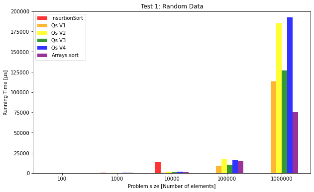
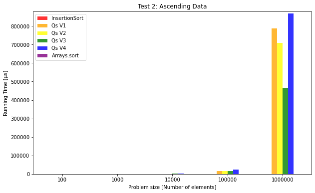
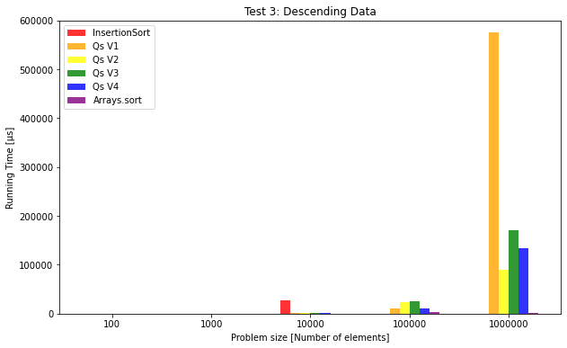
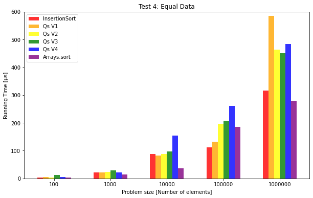

# A Study of Quicksort

## Characteristics and Complexity

Quicksort is a well-known sorting algorithm that was developed by Tony Hoare in 1959. It is known for its efficiency and is commonly used for large sets of data. The algorithm works by partitioning the array into two parts and recursively sorting each sub part until the entire array is sorted. 

The key characteristic of Quicksort is its partitioning process, which involves selecting a pivot value and moving elements smaller than the pivot to one side of the partition and elements larger than the pivot to the other side. This process is then repeated recursively until the array is sorted.

The average-case time complexity of Quicksort is O(nlog(n)), which makes it an efficient sorting algorithm for large datasets. However, in the worst case scenario, Quicksort can result in a time complexity O(n<sup>2</sup>), which can make it less efficient than other algorithms. Despite this, Quicksort is popular due to its efficiency in average cases, its simplicity, and the fact that it is an in-place sorting algorithm and doesn't require additional memory.

## Variations of Quicksort

There are several variations of the Quicksort algorithm, each with its own characteristics and trade-offs. The Quicksort implementations we will discuss in this text are:

* `QuicksortFixedPivot` - uses a fixed pivot for the partitioning algorithm 
* `QuicksortRandomPivot` - uses a randomly selected pivot for the partitioning algorithm
* `QuicksortFixedPivotInsertion` - uses a fixed pivot for the partitioning algorithm with a cut-off to Insertion sort at subarray size 1000.
* `QuicksortRandomPivotInsertion` - uses a randomly selected pivot for the partitioning algorithm with a cut-off to Insertion sort at subarray size 1000.

All the Quicksort variations use the same partitioning algorithm although they call it in different ways which will be discussed below.

In the `QuicksortFixedPivot` variation, the boolean variable `fixedPivot` is set to true when calling the partitioning method:
```java
    int[] pivotIndices = partition(array, low, high, true);
```
In the `QuicksortRandomPivot` variation, the boolean variable `fixedPivot` is set to false when calling the partitioning method:
```java
    int[] pivotIndices = partition(array, low, high, false);
```
This does so that both variations can use the same partitioning algorithm from specifying this variation as the partition is called.

In the partitioning method, `fixedPivot` is also in calling the `pivot` method,  which chooses the pivot element based on whether it should be fixed or not. In addition, the `pivot` is optimized to take the middle element and place it in the middle of the array:
```java
    protected static int pivot(int[] array, int low, int high, boolean fixedPivot) {
        // Chooses mid fixed or randomly
        int mid = (high + low) / 2;
        if (!fixedPivot) mid = low + new Random().nextInt(high-low); 
        // Chooses the middle element of mid, low and high
        if (array[mid] < array[low]) swap(array, mid, low);
        if (array[high] < array[low]) swap(array, high, low);
        if (array[high] < array[mid]) swap(array, high, mid);
        return mid;
    }
```
In this way, all the algorithms can use the same methods and still partition the arrays in two different ways.

In addition to implementing different partitioning approaches, the `QuicksortFixedPivotInsertion` and `QuicksortRandomPivotInsertion` variations both apply a cut-off to the helper method `insertionSort`. This is done by using Insertion sort for the sub-arrays of the recursive calls if they are smaller than a constant (in this case 1000).
```java
    if (low < high) {
        if (high - low < 1000) {
            insertionSort(array, low, high);
        }
        ...
    }
```

In conclusion, the good thing about these cut-off strategies is that the program minimizes code duplication since all variations use the same methods. This also makes it easier to modify the code, since changes only have to be made in one place most of the time. Testing is also made more consistent since we are only testing how the small variations in the implementation affect the results.

However, using these cut-off strategies means that optimizing each variation based on its own logic is not possible. This can be a downside if you want to tailor the algorithm to specific use cases.

## Methodology

A series of empirical evaluations were made in the `TimingQuicksort` class of the four different Quicksort implementations as well as on built-in Arrays.sort and the `insertionSort` method. 

The tests were conducted on data of varying problem sizes, ranging from 100 to 1,000,000 elements. The problem size is defined by five different constants: SMALLEST_ARRAY_SIZE, SMALL_ARRAY_SIZE, MEDIUM_ARRAY_SIZE, LARGE_ARRAY_SIZE, and LARGEST_ARRAY_SIZE.

In this evaluation `QuicksortFixedPivot` will be represented as Qs V1, `QuicksortFixedPivotInsertion` as Qs V2, `QuicksortRandomPivot` as Qs V3, and `QuicksortRandomPivotInsertion` as Qs V4.

The tests were conducted on both equal and randomized data, which was ordered randomly, in ascending, or descending order. The range of the numbers in the randomized arrays have been choosen to be size/2 to ensure a more similar element distribution and number of repeating elements in the data arrays.

The time it took to sort the arrays was measured using the Stopwatch for each algorithm on different data. The program executed ten sorting runs for each algorithm and problem size combination, with the first five runs are discarded to minimize the impact of JVM warmup effects. For each following run, the program outputed the time it took for the algorithm to sort the generated array. At the end of the ten runs, the program calculated and outputed the average run time that were not discarded due to JVM warmup effects.

For each algorithm and problem size the test class was run at least once and the results were saved in the test tables in the unit micorseconds.

## Results

The tables contain timing information for various sorting algorithms for different problem sizes and different input data. The algorithms being compared are `InsertionSort`, four versions of Quicksort (Qs V1, Qs V2, Qs V3, Qs V4), and Arrays.sort, which is a built-in Java method for sorting arrays.

In this test, the input data is randomly generated. As the problem size increases, the execution times of all algorithms also increase. 

| Test 1: Random Data |time µs        |time µs|time µs|time µs|time µs|time µs        |
| ------------------  | ------------- | ----- | ----- | ----- | ----- | ------------- |
| Problem Size        | InsertionSort | Qs V1 | Qs V2 | Qs V3 | Qs V4 | Arrays.sort † |
| 100                 |71             |33     |68     |52     |73     |17             |
| 1000                |449            |88     |373    |132    |470    |442            |
| 10000               |13 328         |608    |1 538  |1 047  |1 547  |885            |
| 100000              |4 130 000      |9 135  |16 752 |10 504 |16 621 |14 437         |
| 1000000             |...            |113 583|185 304|126 913|192 632|75 180         |

In graph 1 below is the visiulized results of the data in the table `Test 1: Random Data`. The bar for `InsertionSort` at problem size 100000 needed to be excluded in the visualization since it disturbed the readibility and scaling of the graph.


In this test, the input data is already sorted in ascending order.

| Test 2: Ascending Data |time µs        |time µs|time µs|time µs|time µs|time µs        |
| ---------------------  | ------------- | ----- | ----- | ----- | ----- | ------------- |
| Problem Size           | InsertionSort | Qs V1 | Qs V2 | Qs V3 | Qs V4 | Arrays.sort † |
| 100                    |3              |27     |3      |49     |3      |3              |
| 1000                   |19             |71     |22     |234    |22     |15             |
| 10000                  |67             |753    |787    |1 279  |898    |36             |
| 100000                 |99             |14 487 |15 486 |16 913 |22 533 |233            |
| 1000000                |270            |788 581|708 151|466 335|867 478|347            |

In graph 2 below is the visiulized results of the data in the table `Test 2: Ascending Data`.


In this test, the input data is sorted in descending order.

| Test 3: Descending Data |time µs        |time µs|time µs|time µs|time µs|time µs        |
| ----------------------  | ------------- | ----- | ----- | ----- | ----- | ------------- |
| Problem Size            | InsertionSort | Qs V1 | Qs V2 | Qs V3 | Qs V4 | Arrays.sort † |
| 100                     |154            |31     |136    |65     |142    |3              |
| 1000                    |276            |83     |321    |133    |344    |36             |
| 10000                   |27 597         |1 058  |1 976  |1 496  |831    |290            |
| 100000                  |8 282 000      |11 573 |24 052 |24 894 |10 708 |3 409          |
| 1000000                 |...            |576 000|89 223 |170 376|133 984|945            |

In graph 3 below is the visiulized results of the data in the table `Test 3: Descending Data`. The bar for `InsertionSort` at problem size 100000 needed to be excluded in the visualization since it disturbed the readibility and scaling of the graph.


In this test, all elements in the input array are equal.

| Test 4: Equal Data  |time µs        |time µs|time µs|time µs|time µs|time µs        |
| ------------------  | ------------- | ----- | ----- | ----- | ----- | ------------- |
| Problem Size        | InsertionSort | Qs V1 | Qs V2 | Qs V3 | Qs V4 | Arrays.sort † |
| 100                 |3              |5      |3      |13     |5      |3              |
| 1000                |22             |22     |23     |29     |21     |15             |
| 10000               |88             |82     |88     |97     |155    |37             |
| 100000              |111            |133    |196    |207    |261    |185            |
| 1000000             |316            |585    |464    |450    |483    |279            |

In graph 3 below is the visiulized results of the data in the table `Test 4: Equal Data`.


## Discussion

### Test 1:
We can see that the execution times of each algorithm increase as the problem size grows. This is to be expected, as the number of comparisons and swaps required to sort the data grows as well.
The performance of each algorithm varies with the problem size, but in general, `Arrays.sort` performs the best as expected. This is not surprising, as the Java API is optimized for performance. `Arrays.sort` is then followed by the various versions of Quicksort, and lastly `InsertionSort` which is expected. With Insertion sort, we have the worst-case complexity of O(n<sup>2</sup>) in comparison to Quicksort's more efficient compelxity of O(nlog(n)) for larger problem sizes. For small problem sizes, Insertion sort is competitive with the other algorithms, but as the problem size grows, it becomes much slower compared to the others.
We can see a trend among the Quicksort algorithms that the variations with fixed pivot generally perform quicker and that using the cut-off strategy to Insertion sort generally makes the sorting slower. This is why `QuicksortFixedPivot` performed the best and `QuicksortRandomPivotInsertion` perfomed the slowest. 
This might be counter intuitive since Insertion sort typically performs better on partially sorted data and Quicksort has better performance on random data. When first roughly sorting the data with Quicksort and then finish sorting the partially sorted data with Insertion sort, that would seem like an ideal solution, althogh these tests showed the opposite. Potentially tweeking the cut-off treshold could help us achive this but that is left to do in another empirical evaluation.

### Test 2:
As expected, the performance of `InsertionSort` and `Arrays.sort` is significantly better compared to Test 1, since the input data is already sorted giving us the best case scenarios for those two algorithms, for instance giving `InsertionSort` a complexity of O(n). 
For Quicksort however, when the pivot is chosen from somewhere in the middle of an already sorted list, it results in a partitioning where one partition has all the elements less than the pivot, and the other has all the elements greater than the pivot. When one partition has all the elements, it means that the other partition is empty. Thus, the quicksort algorithms do not actually sort the list and have no effect. In other words, it causes the worst-case time complexity of O(n<sup>2</sup>), where n is the size of the input list. This is because the algorithm will have to make n recursive calls, with each call only reducing the size of the subproblem by 1.
This can be a reason why the variants with the pivot chosen at random can tend to have a slightly lower run time than the one with a fixed pivot and why the versions with the cut-off strategy to Insertion sort generally perform better.

### Test 3:
For small problem sizes (100 and 1000), `InsertionSort` is the fastest algorithm, while for larger problem sizes, Arrays.sort is consistently the fastest. This is expected, as `InsertionSort` is a simple algorithm that performs well on small inputs, but its time complexity is O(n^2) which makes it inefficient for large inputs, and Arrays.sort is a highly optimized sorting algorithm that is designed to perform well on large inputs.
`QuicksortRandomPivotInsertion` is consistently slower than `QuicksortRandomPivot` for all problem sizes, which indicates that the additional Insertion sort step is not providing any significant improvement.
For larger problem sizes (10000, 100000, and 1000000), `QuicksortFixedPivot` performs the worst, while `QuicksortRandomPivot` and `QuicksortRandomPivotInsertion` perform better. This is expected, as choosing the pivot randomly reduces the chance of the worst-case scenario of having a pivot that splits the list into two unbalanced partitions.
Overall, `QuicksortRandomPivot` is the fastest algorithm among the Quicksort implementations for most problem sizes, while `InsertionSort` is the fastest algorithm for the smallest problem size (100) and Arrays.sort is the fastest algorithm for the largest problem size (1000000).

### Test 4:
Again, `Arrays.sort` performs the best although it's followed by `InsertionSort`. Interestingly, in this test, some versions of Quicksort perform better than others, indicating that the choice of algorithm can make a difference even in non-random input data, even though it's subtle. 
For small problem sizes (n=100), all algorithms perform similarly and are very fast, taking only a few microseconds to complete. However, as the problem size increases, we can see some differences. `InsertionSort` is the fastest algorithm for small and medium-sized problem sizes, but its performance stays linear.
`QuicksortFixedPivotInsertion` and `QuicksortRandomPivot` both perform similarly and are slower than Insertion sort for larger problem sizes. Whereas, `QuicksortRandomPivotInsertion` shows a trend to be among the slower Quicksort variations.
It's worth noting that the choice of pivot strategy can make a difference in the performance of Quicksort. In this evaluation, `QuicksortFixedPivotInsertion` performs better than `QuicksortRandomPivotInsertion` for all problem sizes. However, this may not always be the case, as the best pivot strategy seems to mostly depend on the nature of the input data.

### Conclusion
Overall, the results suggest that for larger problem sizes, `Arrays.sort` is the most efficient sorting algorithm, while `InsertionSort` is the fastest for smaller problem sizes. Among the Quicksort implementations, `QuicksortRandomPivot` is the fastest for most problem sizes, although that can likely be because of the symetry of these tests with reversed or equal data. In the end, the choice of pivot strategy can make a difference in the performance, depending on the nature of the input.